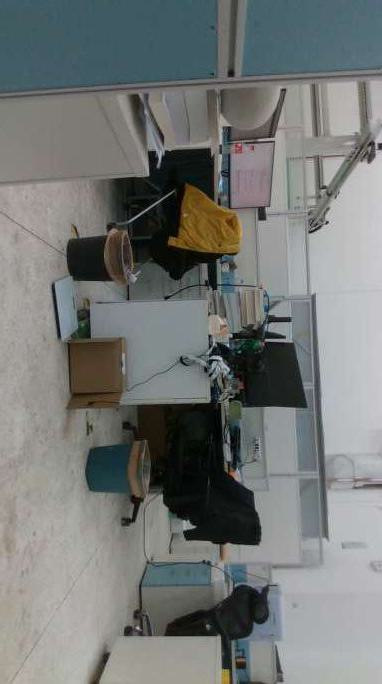
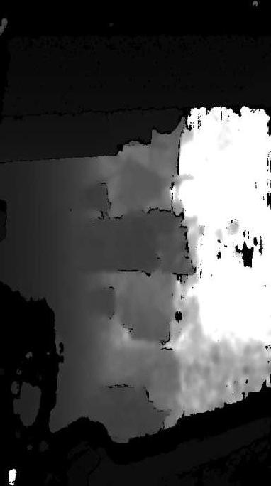

# Perception Layer Debug

## Intel D435i 调试
### 步骤
1. 深度相机Intel D435i在ROS2中有专门的驱动，具体请看网上教程。

2. 打开ROS2节点，发布深度相机话题。 
```
ros2 launch realsense2_camera rs_launch.py
```
打开rqt_image_view可以看到```/camera/camera/color/image_row```和```/camera/camera/depth/image_rect_raw```发布的图像。

<p align="center">
  
  
</p>

### 相关问题
1. Intel D435i 需要USB3.0的数据线，若不是，无法收到图像。

2. Intel NUC 不能将飞控和激光雷达接在同一侧的USB，否则会占用传输内存。